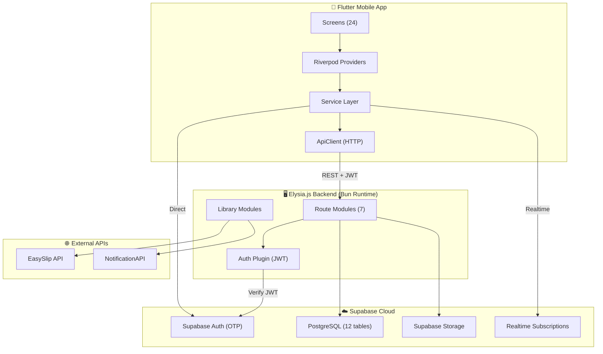
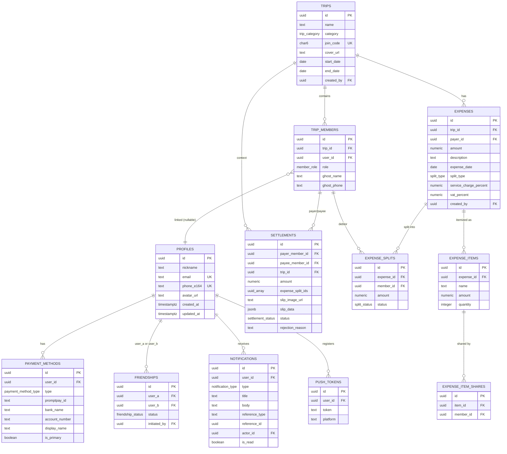
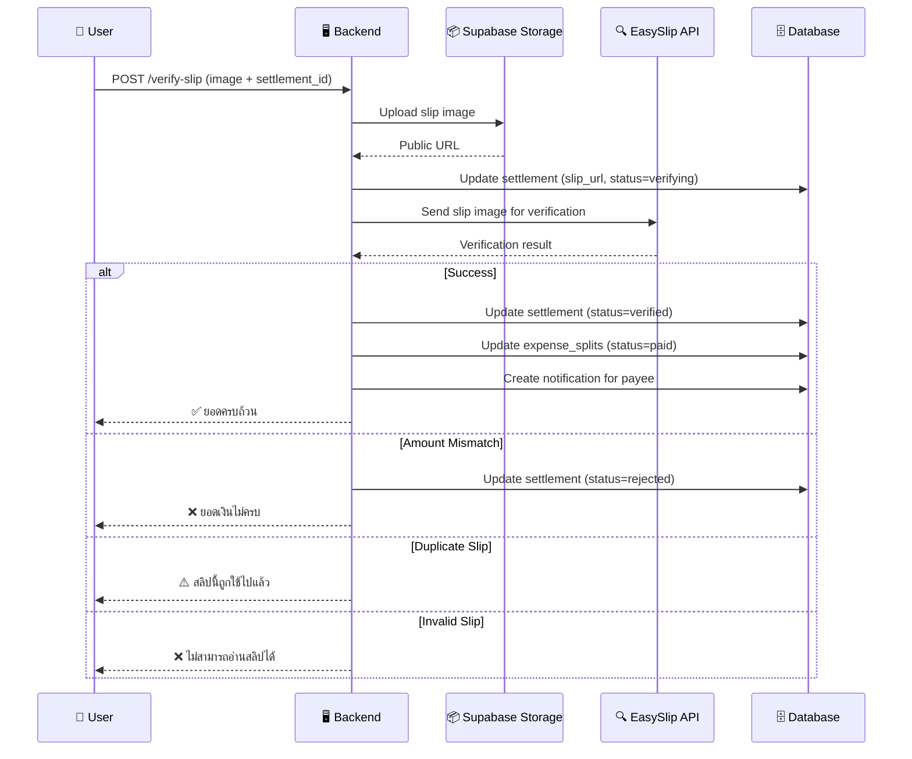
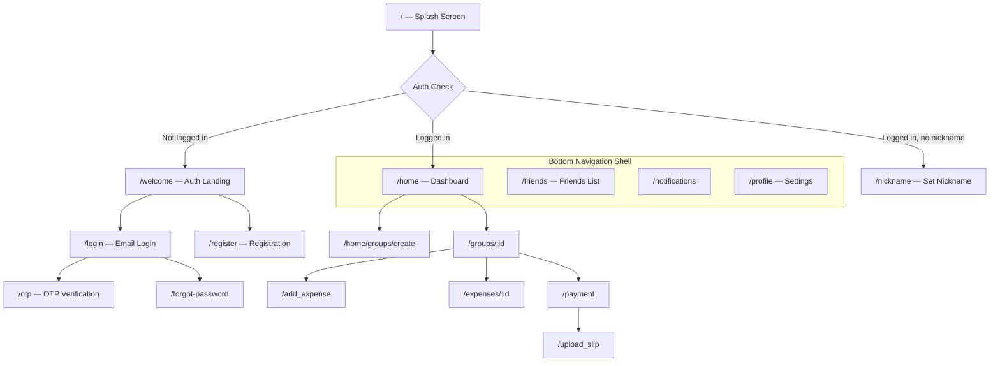
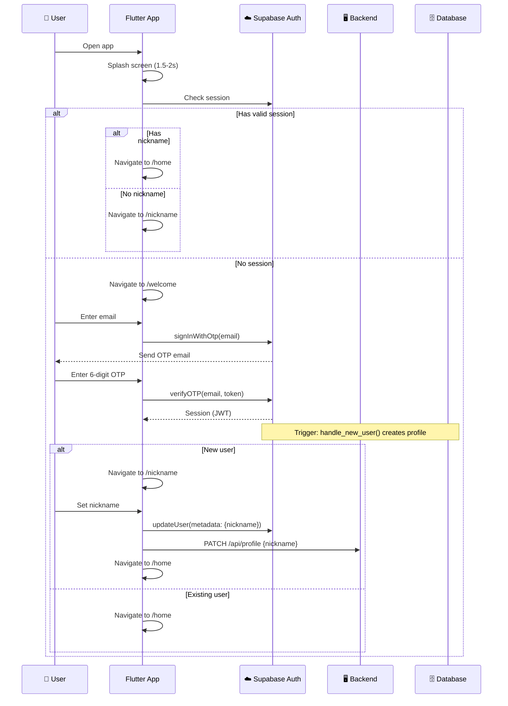

# 🧾 Nub Bill — Project Documentation

> **A Thai-first bill-splitting mobile application** that simplifies expense sharing with PromptPay QR payments and automated slip verification via EasySlip API.

---

## Table of Contents

1. [Project Overview](#project-overview)
2. [Architecture](#architecture)
3. [Tech Stack](#tech-stack)
4. [Repository Structure](#repository-structure)
5. [Database Schema](#database-schema)
6. [Backend API Reference](#backend-api-reference)
7. [Frontend Structure](#frontend-structure)
8. [Authentication Flow](#authentication-flow)
9. [Key Features Deep Dive](#key-features-deep-dive)
10. [Configuration & Environment](#configuration--environment)
11. [Deployment](#deployment)
12. [Development Setup](#development-setup)

---

## Project Overview

**Nub Bill** is a cross-platform mobile app (iOS/Android/Web) that allows groups of friends to:

- Create **groups** (trips, meals, roommates, etc.) and invite friends
- Record **expenses** with flexible split options (equal, exact amounts, percentages)
- Generate **PromptPay QR codes** for payment
- **Verify payment slips** automatically via EasySlip API
- Track **cross-group balances** between friends

### Design Principles

| Principle | Description |
|-----------|-------------|
| 🇹🇭 Thai-first | All UI text and flows are designed in Thai |
| 📱 Mobile-first | Optimized for mobile use with touch interactions |
| ⚡ Fast & Responsive | Minimal latency, real-time updates |
| ✨ Professional | Clean, modern design with LINESeedSansTH font |

### Target Users

- Groups of friends traveling together
- Couples sharing expenses
- Roommates splitting rent and utilities
- Regular dining groups

---

## Architecture



### Data Flow

1. **Authentication**: Flutter ↔ Supabase Auth (email OTP directly, no backend intermediary)
2. **API Calls**: Flutter → `ApiClient` → Backend Routes (JWT in `Authorization` header) → Supabase DB
3. **Slip Verification**: Flutter → Backend `/api/payment/verify-slip` → EasySlip API → Validate & Update DB
4. **Real-time**: Flutter ← Supabase Realtime (subscriptions for group updates)

---

## Tech Stack

| Layer | Technology | Version |
|-------|-----------|---------|
| **Mobile App** | Flutter (Dart) | SDK ^3.10.1 |
| **State Management** | Riverpod | ^2.5.1 |
| **Routing** | GoRouter | ^13.2.0 |
| **Backend Runtime** | Bun | Latest |
| **Backend Framework** | Elysia.js | ^1.4.22 |
| **Database** | PostgreSQL (Supabase) | — |
| **Authentication** | Supabase Auth (Email OTP) | ^2.8.3 |
| **File Storage** | Supabase Storage | — |
| **Slip Verification** | EasySlip API | — |
| **SMS (Legacy)** | NotificationAPI | — |
| **API Documentation** | Swagger (Elysia plugin) | ^1.3.1 |
| **Containerization** | Docker (multi-stage) | Bun 1 |
| **Font** | LINESeedSansTH | Custom (5 weights) |

### Key Flutter Dependencies

| Package | Purpose |
|---------|---------|
| `supabase_flutter` | Auth + Database client |
| `flutter_riverpod` | State management |
| `go_router` | Declarative routing |
| `freezed` / `json_serializable` | Immutable models + JSON |
| `image_picker` | Camera/gallery for slips |
| `qr_flutter` | Generate PromptPay QR |
| `mobile_scanner` | Scan QR codes |
| `share_plus` | Share invite codes |
| `app_links` | Deep linking |
| `google_fonts` | Typography |

---

## Repository Structure

### Frontend — `nub-bill`

```
nub-bill/
├── lib/
│   ├── main.dart                    # Entry point
│   ├── app.dart                     # MaterialApp with theme & router
│   ├── config/
│   │   ├── api_config.dart          # HTTP client + ApiResponse wrapper
│   │   ├── router.dart              # GoRouter with auth redirect
│   │   ├── supabase_config.dart     # Supabase client initialization
│   │   └── theme.dart               # AppTheme (LINESeedSansTH, Sky Blue #81CEF2)
│   ├── models/                      # 9 data models (Freezed)
│   │   ├── balance_entry_model.dart
│   │   ├── debt_entry_model.dart
│   │   ├── expense_detail_model.dart
│   │   ├── expense_model.dart
│   │   ├── friend.dart
│   │   ├── group_model.dart
│   │   ├── trip_category.dart
│   │   ├── trip_member_model.dart
│   │   └── trip_model.dart
│   ├── providers/                   # Riverpod providers
│   │   ├── auth_provider.dart
│   │   ├── expenses_provider.dart
│   │   └── groups_provider.dart
│   ├── services/                    # 10 service classes
│   │   ├── auth_repository.dart     # Supabase auth wrapper
│   │   ├── deep_link_service.dart   # Deep link handling
│   │   ├── expense_repository.dart  # Expenses CRUD (legacy)
│   │   ├── expense_service.dart     # Expenses via API
│   │   ├── friend_service.dart      # Friends management
│   │   ├── group_repository.dart    # Groups CRUD (legacy)
│   │   ├── payment_service.dart     # QR generation, slip upload
│   │   ├── profile_service.dart     # Profile & payment methods
│   │   ├── realtime_service.dart    # Supabase realtime subscriptions
│   │   └── trip_service.dart        # Trips/Groups via API
│   ├── screens/                     # 24 screen widgets
│   │   ├── splash_screen.dart
│   │   ├── onboarding_screen.dart
│   │   ├── authentication_page.dart
│   │   ├── login_page.dart
│   │   ├── register_page.dart
│   │   ├── otp_screen.dart
│   │   ├── nickname_screen.dart
│   │   ├── forgot_password_page.dart
│   │   ├── reset_password_page.dart
│   │   ├── verification_page.dart
│   │   ├── scaffold_with_navbar.dart  # Bottom nav shell (4 tabs)
│   │   ├── home_page.dart             # Main dashboard
│   │   ├── groups_screen.dart         # Groups list
│   │   ├── group_detail_page.dart     # Group details + bills
│   │   ├── create_group_screen.dart   # New group form
│   │   ├── friends_screen.dart        # Friends management
│   │   ├── notifications_screen.dart  # Notification center
│   │   ├── profile_screen.dart        # User profile & settings
│   │   ├── expenses_screen.dart       # Expenses list
│   │   ├── add_expense_screen.dart    # Create expense form
│   │   ├── bill_details_page.dart     # Expense details
│   │   ├── payment_screen.dart        # QR payment page
│   │   ├── upload_slip_screen.dart    # Upload verification slip
│   │   └── login_screen.dart          # Legacy login
│   └── widgets/                     # 3 reusable widgets
│       ├── add_friend_modal.dart
│       ├── group_card.dart
│       └── rounded_button.dart
├── assets/
│   ├── fonts/Line_Seed_Sans_TH/     # 5 font weights
│   └── images/                       # Logo, placeholders
├── pubspec.yaml
└── analysis_options.yaml
```

### Backend — `nub-bill-backend`

```
nub-bill-backend/
├── src/
│   ├── index.ts              # Elysia server entry + Swagger + CORS
│   ├── config/
│   │   └── env.ts            # Type-safe env config
│   ├── lib/
│   │   ├── authPlugin.ts     # JWT auth middleware (Supabase verify)
│   │   ├── supabase.ts       # Supabase admin client
│   │   ├── easyslip.ts       # EasySlip API integration
│   │   ├── promptpay.ts      # PromptPay QR payload generator
│   │   ├── slipok.ts         # SlipOK verification
│   │   └── logger.ts         # Structured logging
│   ├── models/
│   │   └── index.ts          # TypeBox schemas (request/response validation)
│   ├── routes/
│   │   ├── webhook.ts        # Supabase Auth SMS hook
│   │   ├── profile.ts        # Profile + payment methods
│   │   ├── friends.ts        # Friend management + cross-group balance
│   │   ├── trips.ts          # Group/trip CRUD + members
│   │   ├── expenses.ts       # Expense CRUD + splits
│   │   ├── payment.ts        # QR generation + slip verification
│   │   └── notifications.ts  # Notification CRUD + push tokens
│   └── types/
│       └── index.ts          # TypeScript interfaces + enums
├── supabase/
│   ├── schema.sql            # Complete DB schema (852 lines)
│   └── storage_policies.sql  # Storage bucket RLS policies
├── Dockerfile                # Multi-stage build (Bun)
├── docker-compose.yml
├── package.json
└── tsconfig.json
```

---

## Database Schema

The database uses **Supabase (PostgreSQL)** with Row-Level Security (RLS) on all tables.

### Entity Relationship Diagram



### Database Enums

| Enum | Values |
|------|--------|
| `friendship_status` | `pending`, `accepted`, `blocked` |
| `trip_category` | `travel`, `accommodation`, `food`, `romance`, `other` |
| `member_role` | `admin`, `member` |
| `split_type` | `equal`, `exact`, `percent` |
| `split_status` | `unpaid`, `pending`, `paid` |
| `settlement_status` | `pending`, `verifying`, `verified`, `rejected` |
| `payment_method_type` | `promptpay`, `bank_account` |
| `notification_type` | `expense_created`, `expense_updated`, `expense_deleted`, `settlement_pending`, `settlement_verified`, `settlement_rejected`, `friend_request`, `friend_accepted`, `trip_invited`, `trip_joined` |

### Key Database Functions & Triggers

| Function | Purpose |
|----------|---------|
| `generate_join_code()` | Generates random 6-char alphanumeric code for group invites |
| `auto_generate_join_code()` | Trigger: auto-assigns join code on trip INSERT |
| `update_updated_at()` | Trigger: auto-updates `updated_at` on row changes |
| `handle_new_user()` | Trigger: creates profile when `auth.users` row is inserted |
| `claim_ghost_members()` | Trigger: claims ghost members matching phone on profile insert |
| `is_trip_member(uuid)` | Security-definer function for RLS policy recursion prevention |

### Row-Level Security (RLS) Summary

| Table | SELECT | INSERT | UPDATE | DELETE |
|-------|--------|--------|--------|--------|
| `profiles` | All users | — | Own only | — |
| `payment_methods` | Own + friends | Own only | Own only | Own only |
| `friendships` | Own pairs | `initiated_by = self` | Own pairs | Own pairs |
| `trips` | Members only | `created_by = self` | Admin only | Admin only |
| `trip_members` | Fellow members | Self or admin | Admin only | Self or creator |
| `expenses` | Trip members | Trip members (creator) | Creator only | Creator or admin |
| `expense_splits` | Trip members | Creator | Creator or debtor | Creator |
| `settlements` | Payer or payee | Payer only | Payer only | — |
| `notifications` | Own only | — | Own only | Own only |
| `push_tokens` | Own only | Own only | — | Own only |

---

## Backend API Reference

**Base URL**: `http://localhost:3000/api`  
**Swagger Docs**: `http://localhost:3000/docs`

All routes (except `/health` and `/api/webhook/*`) require a valid **Supabase JWT** in the `Authorization: Bearer <token>` header.

### Health Check

| Method | Endpoint | Auth | Description |
|--------|----------|------|-------------|
| GET | `/health` | ❌ | Health check (status, timestamp, version) |

---

### Webhook Routes — `/api/webhook`

| Method | Endpoint | Auth | Description |
|--------|----------|------|-------------|
| POST | `/send-sms` | Webhook Secret | Receives OTP from Supabase Auth, sends SMS via NotificationAPI |

---

### Profile Routes — `/api/profile`

| Method | Endpoint | Auth | Description |
|--------|----------|------|-------------|
| GET | `/` | ✅ | Get current profile with stats (groups, friends, balance) |
| PATCH | `/` | ✅ | Update nickname and/or avatar_url |
| POST | `/avatar` | ✅ | Upload avatar image (multipart) |
| GET | `/qr-code` | ✅ | Get user's QR code data for friend adding |
| GET | `/payment-methods` | ✅ | List payment methods |
| POST | `/payment-methods` | ✅ | Add payment method (PromptPay or bank) |
| PATCH | `/payment-methods/:id` | ✅ | Update a payment method |
| DELETE | `/payment-methods/:id` | ✅ | Delete a payment method |
| POST | `/payment-methods/:id/primary` | ✅ | Set as primary payment method |

---

### Friends Routes — `/api/friends`

| Method | Endpoint | Auth | Description |
|--------|----------|------|-------------|
| GET | `/` | ✅ | List friends with cross-group balances |
| GET | `/requests` | ✅ | List pending friend requests |
| POST | `/request` | ✅ | Send friend request (by email, user_id, or QR) |
| POST | `/:id/accept` | ✅ | Accept friend request |
| POST | `/:id/reject` | ✅ | Reject friend request |
| DELETE | `/:id` | ✅ | Remove/unfriend |
| GET | `/search` | ✅ | Search users by email/nickname |
| GET | `/:id/balance` | ✅ | Get detailed cross-group balance with a friend |

---

### Trips Routes — `/api/trips`

| Method | Endpoint | Auth | Description |
|--------|----------|------|-------------|
| GET | `/` | ✅ | List user's trips with member counts |
| POST | `/` | ✅ | Create new trip (group) |
| GET | `/:id` | ✅ | Get trip details with members |
| PATCH | `/:id` | ✅ | Update trip settings |
| DELETE | `/:id` | ✅ | Delete trip (admin only) |
| POST | `/join` | ✅ | Join trip via invitation code |
| POST | `/:id/members` | ✅ | Add member(s) to trip |
| DELETE | `/:id/members/:memberId` | ✅ | Remove member from trip |
| POST | `/:id/members/ghost` | ✅ | Add ghost member (no account) |
| GET | `/:id/balances` | ✅ | Get balance matrix for trip |
| POST | `/:id/cover` | ✅ | Upload trip cover image |

---

### Expenses Routes — `/api`

| Method | Endpoint | Auth | Description |
|--------|----------|------|-------------|
| GET | `/trips/:id/expenses` | ✅ | List expenses for a trip |
| POST | `/trips/:id/expenses` | ✅ | Create expense (equal or itemized split) |
| GET | `/expenses/:id` | ✅ | Get expense details with splits |
| PATCH | `/expenses/:id` | ✅ | Update expense |
| DELETE | `/expenses/:id` | ✅ | Delete expense (creator only) |
| POST | `/expenses/:id/receipt` | ✅ | Upload expense receipt image |

#### Create Expense Body

```json
{
  "description": "ค่าอาหารเที่ยง",
  "amount": 850,
  "expense_date": "2024-03-17",
  "payer_member_id": "uuid",
  "split_type": "equal | exact | percent",
  "service_charge_percent": 10,
  "vat_percent": 7,
  "split_member_ids": ["uuid1", "uuid2"],
  "splits": [
    { "member_id": "uuid", "amount": 170 }
  ],
  "items": [
    {
      "name": "ข้าวผัด",
      "amount": 120,
      "quantity": 1,
      "shared_by_member_ids": ["uuid1", "uuid2"]
    }
  ]
}
```

---

### Payment Routes — `/api/payment`

| Method | Endpoint | Auth | Description |
|--------|----------|------|-------------|
| POST | `/generate-qr` | ✅ | Generate PromptPay QR payload for payment |
| POST | `/verify-slip` | ✅ | Upload slip image, verify via EasySlip, settle debts |
| GET | `/settlements/:tripId` | ✅ | List settlements for a trip |

#### Slip Verification Flow



---

### Notifications Routes — `/api/notifications`

| Method | Endpoint | Auth | Description |
|--------|----------|------|-------------|
| GET | `/` | ✅ | List notifications (paginated) |
| GET | `/unread-count` | ✅ | Get unread notification count (badge) |
| PATCH | `/:id/read` | ✅ | Mark single notification as read |
| POST | `/read-all` | ✅ | Mark all notifications as read |
| DELETE | `/:id` | ✅ | Delete a notification |
| POST | `/push-token` | ✅ | Register FCM push token |
| DELETE | `/push-token` | ✅ | Unregister push token |

---

## Frontend Structure

### Navigation Architecture

The app uses `GoRouter` with a `StatefulShellRoute` for bottom navigation:



### Bottom Navigation Tabs

| Index | Path | Screen | Thai Label |
|-------|------|--------|------------|
| 0 | `/home` | `HomePage` | กลุ่ม (Groups) |
| 1 | `/friends` | `FriendsScreen` | เพื่อน (Friends) |
| 2 | `/notifications` | `NotificationsScreen` | แจ้งเตือน (Notifications) |
| 3 | `/profile` | `ProfileScreen` | โปรไฟล์ (Profile) |

### Screen Inventory (24 screens)

| Screen | File | Purpose |
|--------|------|---------|
| Splash | `splash_screen.dart` | Logo + auth check |
| Onboarding | `onboarding_screen.dart` | First-time feature introduction |
| Auth Landing | `authentication_page.dart` | Login/Register gateway |
| Login | `login_page.dart` | Email + password login |
| Register | `register_page.dart` | New account registration |
| OTP | `otp_screen.dart` | 6-digit OTP verification |
| Nickname | `nickname_screen.dart` | First-time nickname setup |
| Forgot Password | `forgot_password_page.dart` | Password reset request |
| Reset Password | `reset_password_page.dart` | New password entry |
| Email Verification | `verification_page.dart` | Email verification handling |
| Nav Shell | `scaffold_with_navbar.dart` | Bottom nav with 4 tabs |
| Home | `home_page.dart` | Dashboard with groups list |
| Groups | `groups_screen.dart` | Groups list view |
| Group Detail | `group_detail_page.dart` | Trip details, bills, balances |
| Create Group | `create_group_screen.dart` | New group form with members |
| Friends | `friends_screen.dart` | Friend list + requests + balance |
| Notifications | `notifications_screen.dart` | Notification center |
| Profile | `profile_screen.dart` | Profile, settings, payment methods |
| Expenses | `expenses_screen.dart` | Trip expense list |
| Add Expense | `add_expense_screen.dart` | Create expense with splits |
| Bill Details | `bill_details_page.dart` | Expense detail view |
| Payment | `payment_screen.dart` | PromptPay QR generation |
| Upload Slip | `upload_slip_screen.dart` | Slip photo upload |
| Legacy Login | `login_screen.dart` | Old login screen |

### State Management (Riverpod)

| Provider | File | Manages |
|----------|------|---------|
| `authProvider` | `auth_provider.dart` | Auth state from Supabase |
| `groupsProvider` | `groups_provider.dart` | Groups/trips list |
| `expensesProvider` | `expenses_provider.dart` | Expenses for a trip |

### Service Layer

| Service | File | Responsibilities |
|---------|------|-----------------|
| `AuthRepository` | `auth_repository.dart` | Supabase auth (signIn, signUp, signOut, session) |
| `TripService` | `trip_service.dart` | Create/read/update/delete trips via API |
| `ExpenseService` | `expense_service.dart` | Expense CRUD via API |
| `FriendService` | `friend_service.dart` | Friend requests, search, balance |
| `PaymentService` | `payment_service.dart` | QR generation, slip upload |
| `ProfileService` | `profile_service.dart` | Profile CRUD, payment methods |
| `RealtimeService` | `realtime_service.dart` | Supabase realtime subscriptions |
| `DeepLinkService` | `deep_link_service.dart` | Group invite deep links |

### Theme & Styling

```
Primary Color:    #81CEF2 (Sky Blue)
Secondary Color:  #141416 (Dark)
Error Color:      #E53935 (Red)
Success Color:    #43A047 (Green)
Font Family:      LINESeedSansTH (5 weights: 100, 400, 700, 800, 900)
Button Shape:     Rounded (30px border radius)
Input Shape:      Rounded (30px border radius)
```

---

## Authentication Flow



### Auth Redirect Logic (GoRouter)

The router's `redirect` function enforces:

1. **Splash (`/`)**: Always allowed (handles initial routing)
2. **Not logged in**: Redirected to `/welcome`
3. **Logged in, no nickname**: Redirected to `/nickname`
4. **Logged in + nickname + on auth page**: Redirected to `/home`

---

## Key Features Deep Dive

### 1. Group Management

- Groups are called "trips" in the database
- Each has a unique **6-character join code** (auto-generated, alphanumeric)
- Supports **5 categories**: Travel ✈️, Accommodation 🏠, Food 🍽️, Romance ❤️, Other 📦
- **Ghost members**: People without accounts can be added by name + phone; auto-claimed when they sign up
- Optional **cover image** (stored in Supabase Storage)
- Date range support for trip duration

### 2. Expense Splitting

Three split modes:

| Mode | Thai Name | Behavior |
|------|-----------|----------|
| Equal | หารเท่า | Auto-divide by selected members |
| Exact | ระบุเอง | Manual amount per member (sum must match total) |
| Percent | เป็นเปอร์เซ็นต์ | Percentage per member (must total 100%) |

Additional features:
- **Service charge** and **VAT** percentages (applied on base amount)
- **Itemized bills**: Individual items with per-item member sharing
- **Receipt image** upload

### 3. Payment & Slip Verification

Payment settlement uses **PromptPay** (Thailand's national payment standard):

1. User taps "Pay" on outstanding balance
2. Backend generates QR payload using payee's PromptPay ID
3. User transfers money via banking app
4. User takes photo of bank slip
5. Backend uploads slip to Supabase Storage
6. Backend sends slip to **EasySlip API** for verification
7. EasySlip returns: amount, sender, receiver, reference, duplicate check
8. Backend validates against expected settlement amount
9. On success: marks splits as paid, notifies payee

### 4. Cross-Group Balance

Friends can see **total net balance** across all shared groups:
- Positive = friend owes you (green)
- Negative = you owe friend (red)
- Calculated by aggregating unpaid expense splits across shared trips

### 5. Notifications

10 notification types covering all key events (expense CRUD, settlements, friend operations, trip invites). Supports:
- In-app notification feed with pagination
- Unread badge count
- FCM push token registration (iOS/Android/Web)
- Mark as read (single or bulk)

---

## Configuration & Environment

### Backend Environment Variables

| Variable | Required | Description |
|----------|----------|-------------|
| `PORT` | No | Server port (default: `3000`) |
| `NODE_ENV` | No | `development` or `production` (default: `development`) |
| `ALLOWED_ORIGINS` | No | CORS origins, comma-separated or `*` |
| `SUPABASE_URL` | ✅ | Supabase project URL |
| `SUPABASE_ANON_KEY` | ✅ | Supabase anon (public) key |
| `SUPABASE_SERVICE_ROLE_KEY` | ✅ | Supabase service role key (admin) |
| `SUPABASE_WEBHOOK_SECRET` | ✅ | Secret for webhook verification |
| `NOTIFICATION_API_CLIENT_ID` | ✅ | NotificationAPI client ID |
| `NOTIFICATION_API_CLIENT_SECRET` | ✅ | NotificationAPI client secret |
| `EASYSLIP_API_KEY` | ✅ | EasySlip API key for slip verification |
| `TEST_PHONE_NUMBERS` | No | Comma-separated test phone numbers (bypass SMS) |

### Frontend API Configuration

The `ApiConfig` class auto-selects the backend URL:

| Platform | URL |
|----------|-----|
| Web | `http://localhost:3000` |
| Android Emulator | `http://10.0.2.2:3000` |
| iOS Simulator / Desktop | `http://localhost:3000` |
| Custom | `--dart-define=API_BASE_URL=http://<host>:3000` |

---

## Deployment

### Docker (Backend)

The backend uses a **multi-stage Docker build** with Bun:

```dockerfile
# Build stage - install deps
FROM oven/bun:1 AS builder
COPY package.json bun.lockb* ./
RUN bun install --frozen-lockfile --production
COPY src/ ./src/

# Runtime stage - slim image
FROM oven/bun:1-slim
COPY --from=builder /app/ ./
ENV NODE_ENV=production
EXPOSE 3000
CMD ["bun", "run", "start"]
```

**Docker Compose** maps port `3001` → `3000` (container) and reads `.env.production`.

### Health Check

```
GET /health
→ { "status": "ok", "timestamp": "...", "version": "1.0.0" }
```

Docker health check runs every 30s with 5s timeout, 3 retries.

---

## Development Setup

### Prerequisites

- **Flutter** SDK ≥ 3.10.1
- **Bun** runtime (latest)
- **Supabase** project with Auth enabled (Email OTP)
- **EasySlip** API key

### Backend

```bash
# 1. Navigate to backend
cd nub-bill-backend

# 2. Install dependencies
bun install

# 3. Copy and configure environment
cp .env.example .env
# Edit .env with your Supabase + EasySlip credentials

# 4. Apply database schema
# Run supabase/schema.sql and supabase/storage_policies.sql
# in your Supabase SQL Editor

# 5. Start dev server (hot reload)
bun run dev
# Server at http://localhost:3000
# Swagger at http://localhost:3000/docs
```

### Frontend

```bash
# 1. Navigate to frontend
cd nub-bill

# 2. Install dependencies
flutter pub get

# 3. Generate Freezed models
dart run build_runner build --delete-conflicting-outputs

# 4. Run the app
flutter run

# To connect to a custom backend:
flutter run --dart-define=API_BASE_URL=http://your-backend:3000
```

### API Documentation

Once the backend is running, visit `http://localhost:3000/docs` for the interactive **Swagger UI** with all endpoints, request/response schemas, and live testing.

---

> Made with 💛 by Chin
