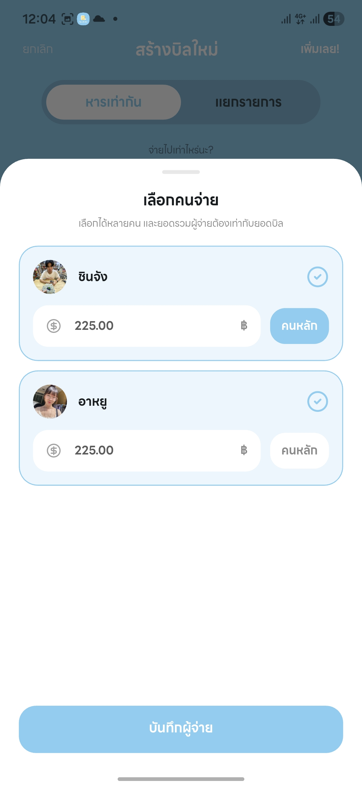
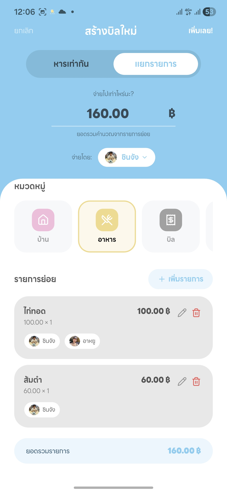
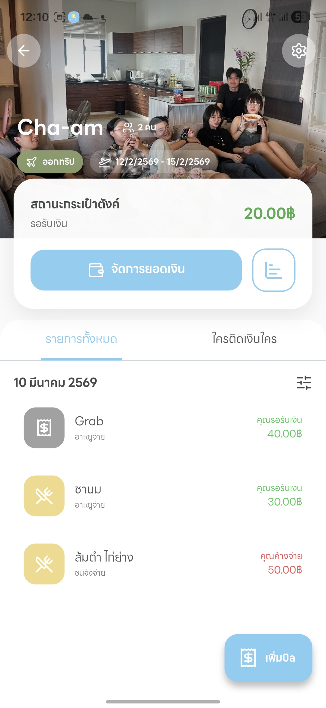
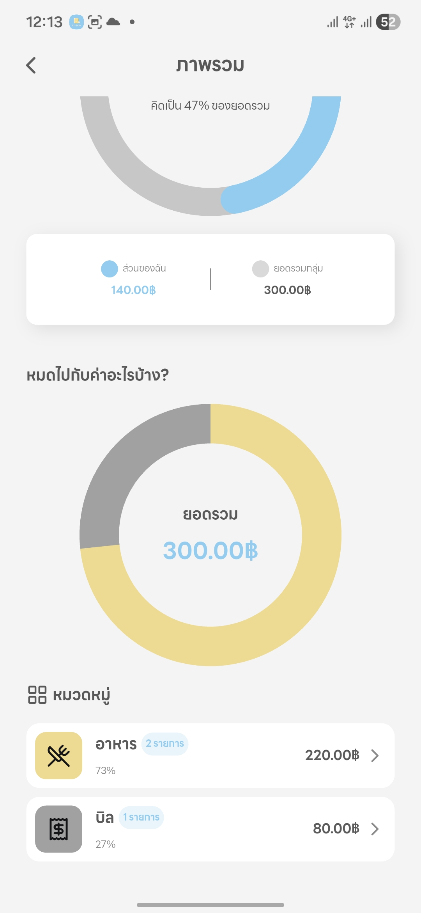
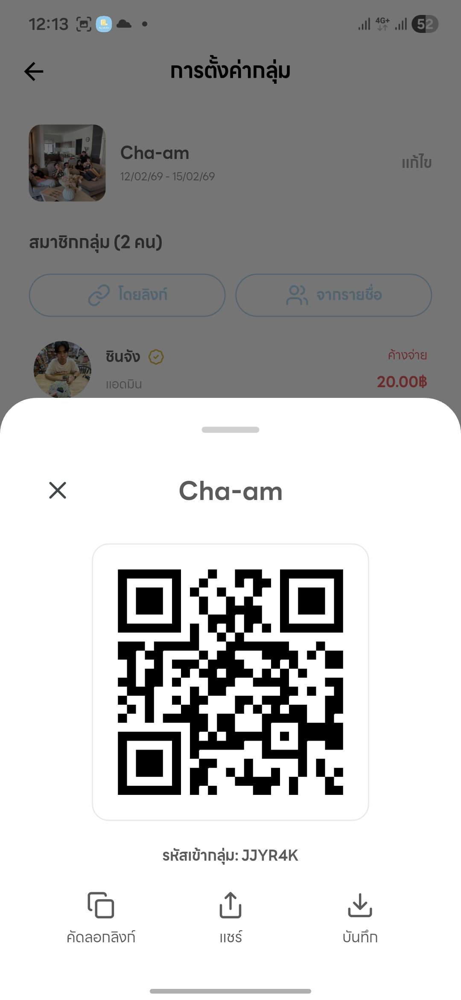

# Nub-Bill

> **Real-time Visual Bill-Splitting Tool for Groups**
> *Simplify group travel expenses with automated debt clearing and slip verification.*

## 🎥 Demo Video

> คลิกที่รูปด้านบนเพื่อดูวิดีโอสาธิตการใช้งานบน YouTube

---

## Introduction

**Nub-Bill** (หรือ "นับบิล") เกิดขึ้นเพื่อแก้ปัญหาความซับซ้อนทางการเงินเมื่อออกทริปเป็นกลุ่ม (Group Travel) ซึ่งมักมีผู้สำรองจ่ายหลายคน และตัวหารในแต่ละรายการไม่เท่ากัน (เช่น ค่าเดินทางหารเฉพาะคนนั่งรถ, ค่าอาหารหารเฉพาะคนกิน) การใช้ Spreadsheet แบบเดิมมีความยุ่งยากในการกรอกข้อมูล และเมื่อจบทริปมักเกิดความสับสนในการเคลียร์หนี้ อีกทั้งยังขาดระบบตรวจสอบสลิปการโอนเงินที่น่าเชื่อถือ

แอปพลิเคชันนี้มุ่งเน้นกลุ่มเป้าหมายคือ **กลุ่มเพื่อนที่ไปเที่ยวต่างจังหวัด** ที่มีการแชร์ค่าใช้จ่ายซับซ้อน (มีคนขับรถ, มีคนจองที่พัก, มีคนซื้อของกองกลาง) โดยเน้นประสบการณ์การใช้งานแบบ Real-time ร่วมกัน

## Features

### MVP Features (Core Functionality)
- [ ] **Smart Expense Recording:** บันทึกรายการจ่ายเงินระบุ "คนจ่าย" และ "คนหาร" ได้อย่างอิสระ
- [ ] **Sub-Group Management:** แก้ปัญหาค่าเดินทาง/น้ำมัน โดยการตั้ง Group ย่อย (เช่น กลุ่มรถคันที่ 1, กลุ่มรถคันที่ 2) เลือกหารเฉพาะกลุ่มได้ในคลิกเดียว
- [ ] **Auto Debt Simplification:** คำนวณยอดสุทธิอัตโนมัติ หักลบกลบหนี้ระหว่างกันเพื่อลดจำนวน Transaction การโอนให้เหลือน้อยที่สุด
- [ ] **PromptPay QR & Slip Verification:** (Highlight Feature) ระบบสร้าง QR Code รับเงินและตรวจสอบสลิป
- [ ] **Negative Balance Support:** รองรับยอดเงินติดลบสำหรับกรณีได้รับเงินคืน (Cashback/Refund) เพื่อหักลบกับค่าใช้จ่ายรวมได้อย่างถูกต้อง
- [ ] **Quick Invite:** เชิญเพื่อนเข้าทริปผ่าน QR Code หรือ Deep Link โดยไม่ต้องค้นหา Username
- [ ] **Visual Summary:** สร้างรูปภาพสรุปยอดหนี้สินของแต่ละคน เพื่อส่งเข้า LINE/Messenger ได้ทันที

### Nice-to-have Features (Future Roadmap)

---

## 📱 Screenshots

### Core Features in Action

| | |
|:---:|:---:|
|  |  |
| **Smart Expense Recording** — บันทึกรายการ ระบุผู้จ่ายและผู้หาร | **Sub-Group Management** — จัดการกลุ่มย่อย หารเฉพาะกลุ่มได้ |
|  |  |
| **Auto Debt Simplification** — คำนวณยอดสุทธิ หักลบกลบหนี้อัตโนมัติ | **Trip & Member Overview** — ภาพรวมทริปและสมาชิก |
|  |  |
| **Deep Link / QR Trip Invitation** — ชวนเพื่อนด้วย QR หรือ Deep Link | **PromptPay QR Generation** — สร้าง QR Code รับเงิน + **Slip Verification** — ตรวจสอบสลิปโอนเงินผ่าน Thunder Solution |

---

### Nice-to-have Features (Future Roadmap)
- [ ] **AI Receipt Scanning (OCR):** ใช้ Google ML Kit สแกนใบเสร็จยาวๆ แปลงเป็นรายการ Digital
- [ ] **Real-time Activity Log:** Audit Log แสดงความเคลื่อนไหวทันทีที่มีการเพิ่ม/ลบ/แก้ไข รายการ
- [ ] **Ghost Member Support:** สร้างสมาชิกสมมติสำหรับเพื่อนที่ไม่ได้โหลดแอปฯ
- [ ] **Spending Analytics:** Dashboard กราฟสรุปพฤติกรรมการใช้จ่ายของทริป (Pie Chart/Ranking)
- [ ] **Smart Debt Visualization:** Node Graph แสดงเส้นทางการไหลของเงิน

---

## Technical Architecture & Implementation

สถาปัตยกรรมของระบบถูกออกแบบให้รองรับการทำงานแบบ **Real-time Synchronization** และมีความปลอดภัยสูงในการตรวจสอบธุรกรรมการเงิน โดยแบ่งส่วนการทำงานดังนี้:

### 1. Backend-as-a-Service (Supabase)
ทำหน้าที่เป็นศูนย์กลางข้อมูลของระบบ (Centralized Data Store) เพื่อให้สมาชิกในทริปเห็นข้อมูลตรงกันทันที
* **Database:** ใช้ PostgreSQL ในการจัดเก็บความสัมพันธ์ระหว่าง Users, Trips และ Transactions
* **Real-time Engine:** ใช้ความสามารถของ Supabase Realtime (Postgres Changes) เพื่อ Sync สถานะการหารเงินและรายการใหม่ไปยังเครื่องของสมาชิกทุกคนทันทีผ่าน Websocket
* **Object Storage:** จัดเก็บรูปภาพสลิปโอนเงินอย่างปลอดภัยด้วย Row Level Security (RLS)

### 2. Secure Custom API (ElysiaJS on Bun)
ทำหน้าที่เป็น **Secure Gateway** สำหรับ Business Logic ที่มีความละเอียดอ่อนและต้องติดต่อกับ Third-party Service
* **Slip Verification Proxy:** ระบบใช้ ElysiaJS เป็นตัวกลางในการรับค่า Transaction Reference จากแอปพลิเคชัน และส่งต่อไปตรวจสอบกับ **SlipOK API**
    * *เหตุผลทางเทคนิค:* การใช้ Custom API ช่วยให้สามารถซ่อน API Key ของ SlipOK (Server-to-Server) ไม่ให้รั่วไหลไปสู่ฝั่ง Client Application
* **Complex Calculation:** รองรับการคำนวณ Debt Simplification Algorithm ที่ซับซ้อนในอนาคต

### 3. Client-side Processing
* **PromptPay QR Generation:** สร้าง QR Code ตามมาตรฐาน **EMVCo (Tag 30)** ภายในแอปพลิเคชัน โดยคำนวณ CRC16-CCITT และ Proxy ID (เบอร์โทร/บัตรประชาชน) เพื่อลดภาระ Server และทำงานได้แม้ Offline เบื้องต้น

---

## Tech Stack

### Frontend (Mobile Application)
* **Framework:** Flutter (Dart)
* **State Management:** Riverpod / Bloc
* **Offline Capability:** SQLite / Hive (Local caching)
* **Image Processing:** Google ML Kit

### Backend & Infrastructure
* **Core Backend (BaaS):** [Supabase](https://supabase.com)
    * PostgreSQL (Database)
    * Supabase Realtime (Websocket)
    * Supabase Storage (Object Storage)
    * Supabase Auth
* **Custom API Service:** [ElysiaJS](https://elysiajs.com) (Running on [Bun](https://bun.sh))
    * ทำหน้าที่เป็น API Gateway สำหรับตรวจสอบสลิปและประมวลผล Logic ที่ซับซ้อน

### External Services
* **Slip Verification:** SlipOK API (Free Tier)

---

## Non-functional Requirements
* **Data Consistency:** ข้อมูลยอดเงินต้องตรงกันทุกเครื่องแบบ Real-time (Eventual Consistency via Websocket).
* **Precision:** การคำนวณทศนิยม 2 ตำแหน่งมีความแม่นยำสูง (Double-entry principle).
* **Security:** API Keys ของ Third-party ต้องไม่ถูกฝังใน Source Code ของแอปพลิเคชัน
