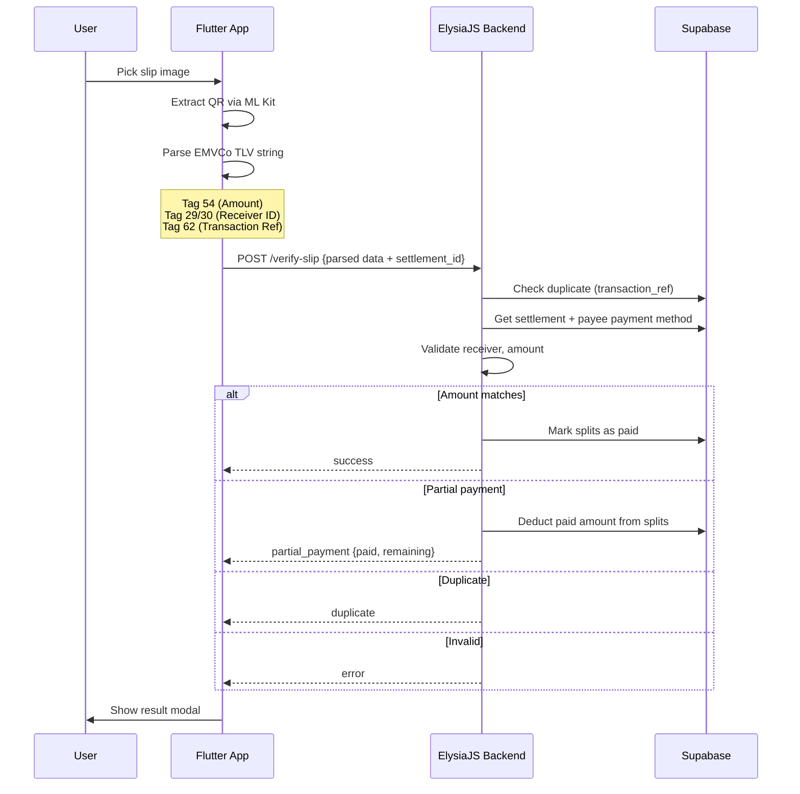

# Payment Flow & Slip Verification Implementation

Redesign the payment screen to match prototypes and implement zero-cost slip verification using **client-side QR extraction** (no third-party API). Flutter extracts the mini QR from the slip image, parses EMVCo TLV data, and sends parsed fields to the backend for server-side validation. Partial payment deduction is supported for amount mismatches.

---

## Architecture Overview



---

## Proposed Changes

### Flutter – New Dependency

#### [MODIFY] [pubspec.yaml](file:///c:/Users/chin9/OneDrive/Documents/GitHub/nub-bill/pubspec.yaml)

Add `google_mlkit_barcode_scanning` for on-device QR extraction from slip images:
```yaml
google_mlkit_barcode_scanning: ^0.12.0
```

---

### Flutter – EMVCo TLV Parser Utility

#### [NEW] [promptpay_parser.dart](file:///c:/Users/chin9/OneDrive/Documents/GitHub/nub-bill/lib/services/promptpay_parser.dart)

Dart utility class to parse the EMVCo TLV string extracted from Thai bank slip QR codes:

- `parseTlv(String raw)` → Recursively parse TLV tag-length-value structure
- Extract **Tag 54** → Transaction Amount
- Extract **Tag 29** or **Tag 30** → Merchant Account Info → sub-parse for PromptPay ID (AID `A000000677010111`, sub-tag `01`/`02`)
- Extract **Tag 62** → Additional Data → sub-tag `05` (Bill Number / Transaction Reference)
- Returns `SlipQrData { amount, receiverId, transactionRef, rawPayload }`
- Validate CRC (Tag 63) for data integrity

---

### Flutter – QR Extraction Service

#### [NEW] [slip_scanner_service.dart](file:///c:/Users/chin9/OneDrive/Documents/GitHub/nub-bill/lib/services/slip_scanner_service.dart)

Service using `google_mlkit_barcode_scanning` to extract QR data from a picked image:

- `scanSlipImage(String imagePath)` → `Future<SlipQrData?>`
- Creates `InputImage.fromFilePath(path)`
- Uses `BarcodeScanner` with `BarcodeFormat.qrCode` filter
- If QR found → parse raw value via `PromptPayParser`
- If no QR found → return null (triggers "unreadable" modal)
- Properly disposes scanner resources

---

### Flutter – Payment Screen Redesign

#### [MODIFY] [payment_screen.dart](file:///c:/Users/chin9/OneDrive/Documents/GitHub/nub-bill/lib/screens/payment_screen.dart)

Complete UI rebuild to match `สแกนจ่าย.png`:

**Layout (top to bottom):**
- AppBar: white, centered "สแกนจ่าย", back arrow
- Rounded card container with subtle shadow:
  - Receiver avatar (circular, 64px)
  - Receiver name (bold, centered)
  - "พร้อมเพย์: 081-xxx-xxxx" + copy icon (masked PromptPay ID)
  - QR code image (centered, ~220px, using `qr_flutter`)
  - "ยอดที่ต้องชำระ" label
  - Amount in sky blue bold (`550.00฿`)
  - "บันทึกรูป QR Code" outlined button with download icon
- Bottom fixed: full-width "แนบสลิปการโอน" rounded button with paperclip icon

**Behavior:**
- Tap "แนบสลิปการโอน" → open `image_picker` (gallery)
- After image picked → show verifying modal → call `SlipScannerService.scanSlipImage()`
- If QR not found → show unreadable modal
- If QR found → send parsed data to backend → show result modal based on response

Also pass new fields via route extras: `payeeName`, `payeeAvatarUrl`, `promptpayId`

---

### Flutter – Slip Verification Modal

#### [NEW] [slip_verification_modal.dart](file:///c:/Users/chin9/OneDrive/Documents/GitHub/nub-bill/lib/widgets/slip_verification_modal.dart)

Single modal widget with 5 states, each matching its prototype exactly:

| State | Icon | Title | Subtitle | Action |
|-------|------|-------|----------|--------|
| `verifying` | Loading spinner (yellow) | กำลังส่องสลิปให้! | รอนับบิลแป๊บนึงน้า... ระบบกำลังเช็คยอดเงินให้อยู่ | None |
| `success` | ✅ Green badge-check | ยอดครบถ้วนจ้า! | อัปเดตสถานะกระเป๋าตังค์ พร้อมแจ้งเตือนเพื่อนให้แล้วน้า | Auto-close 3s |
| `unreadable` | ⚠️ Red circle-alert | เอ๊ะ! อ่านสลิปไม่ได้ | หับหา QR Code ไม่เจอเลย แนบสลิปใหม่ที่ชัดกว่านี้อีกทีน้า | แนบสลิป button |
| `amount_mismatch` | ⚠️ Red circle-alert | อุ้ย! ยอดเงินไม่ตรง | ยอดในสลิปไม่เท่ากับยอดที่ค้าง ลองเช็คแล้วแนบสลิปใหม่หน่อยน้า | แนบสลิป button |
| `duplicate` | ⚠️ Red circle-alert | หืม? สลิปนี้ใช้ไปแล้วนะ | เหมือนสลิปนี้เคยส่งไปแล้วเลย ลองเช็คแล้วแนบสลิปใหม่หน่อยน้า | แนบสลิป button |

- Background: dimmed (grey overlay behind the card)
- Modal: white rounded card, centered content
- Error modals include "แนบสลิป" button with paperclip icon that re-opens image picker
- Amount mismatch modal also displays: paid amount, deducted amount, remaining debt

---

### Flutter – Payment Service Update

#### [MODIFY] [payment_service.dart](file:///c:/Users/chin9/OneDrive/Documents/GitHub/nub-bill/lib/services/payment_service.dart)

- Update [SlipVerificationResult](file:///c:/Users/chin9/OneDrive/Documents/GitHub/nub-bill/lib/services/payment_service.dart#40-62) model with: `status` (`success` | `unreadable` | `amount_mismatch` | `duplicate` | `partial_payment`), `paidAmount`, `remainingAmount`, `isDuplicate`
- Replace current [verifySlip](file:///c:/Users/chin9/OneDrive/Documents/GitHub/nub-bill-backend/src/lib/easyslip.ts#133-208) (image upload) with new `verifySlipData` method that sends **parsed QR data** (not the image):
  ```dart
  Future<SlipVerificationResult> verifySlipData({
    required String settlementId,
    required double amount,
    required String receiverId,
    required String transactionRef,
  })
  ```
- Uses normal JSON POST (no multipart needed since we're not uploading images)

---

### Flutter – AppIcons Addition

#### [MODIFY] [app_icons.dart](file:///c:/Users/chin9/OneDrive/Documents/GitHub/nub-bill/lib/shared/app_icons.dart)

Add: `paperclip` (`LucideIcons.paperclip`), `copy` (`LucideIcons.copy`), `badgeCheck` (`LucideIcons.badgeCheck`)

---

### Flutter – Router Update

#### [MODIFY] [router.dart](file:///c:/Users/chin9/OneDrive/Documents/GitHub/nub-bill/lib/config/router.dart)

- Update `/payment` route extras to include `payeeName`, `payeeAvatarUrl`, `promptpayId`
- `/upload_slip` route can be removed (functionality merged into payment screen)

---

### Backend – New Verify-Slip Endpoint (Client-Side QR Data)

#### [MODIFY] [payment.ts](file:///c:/Users/chin9/OneDrive/Documents/GitHub/nub-bill-backend/src/routes/payment.ts)

Replace the current image-upload-based `/verify-slip` with a JSON endpoint receiving **parsed QR data**:

**Request body:**
```typescript
{
  settlement_id: string,     // UUID
  amount: number,            // from Tag 54
  receiver_id: string,       // from Tag 29/30 (PromptPay ID)
  transaction_ref: string,   // from Tag 62
}
```

**Validation steps:**
1. Fetch settlement + payee payment method from Supabase
2. **Duplicate check**: Query `settlements.slip_data` for existing `transaction_ref`
3. **Receiver validation**: Compare `receiver_id` with payee's `promptpay_id` (normalized)
4. **Amount validation**:
   - **Exact/overpaid** → Mark all splits as `paid`, settlement as `verified`
   - **Underpaid (partial payment)** → Deduct paid amount from splits (oldest first), create verified settlement for the paid portion, return remaining debt
   - **No amount in QR** → Accept if other validations pass (some slips omit amount)

**Partial payment deduction logic:**
```
For each expense_split (ordered by created_at ASC):
  if remaining_to_pay >= split.amount:
    mark split as 'paid'
    remaining_to_pay -= split.amount
  else if remaining_to_pay > 0:
    reduce split.amount by remaining_to_pay
    remaining_to_pay = 0
  else:
    break
```

**Response:**
```typescript
{
  success: boolean,
  status: 'success' | 'partial_payment' | 'amount_mismatch' | 'duplicate' | 'receiver_mismatch',
  message: string,
  paidAmount?: number,
  remainingAmount?: number,
  deductedSplitCount?: number,
}
```

> [!NOTE]
> The existing [easyslip.ts](file:///c:/Users/chin9/OneDrive/Documents/GitHub/nub-bill-backend/src/lib/easyslip.ts) is kept as-is but will no longer be imported by the verify-slip route. It can serve as a future fallback if needed.

---

## Verification Plan

### Automated Tests
```bash
cd c:\Users\chin9\OneDrive\Documents\GitHub\nub-bill
flutter analyze
```

### Manual Verification
1. Navigate to debt → tap pay → verify payment screen matches `สแกนจ่าย.png`
2. Tap "แนบสลิปการโอน" → pick image → verify loading modal matches `กำลังตรวจสอบสลิป.png`
3. Submit valid slip → verify success modal matches `สลิปถูกต้อง Modal.png`
4. Submit slip with no QR → verify error modal matches `สลิปผิดพลาด Modal.png`
5. Submit duplicate slip → verify modal matches `Duplicated Slip Verified.png`
6. Submit slip with wrong amount → verify modal matches `Amount Mismatch.png` with deduction info
